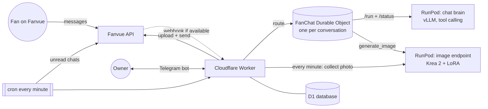

# Architecture

## Big picture

## Request paths

| Path | Who calls | What happens |
|---|---|---|
| `GET /setup` | owner, once | sets the Telegram webhook, shows a one-time claim link (first tap = owner), shows the Fanvue redirect URL |
| `POST /telegram` | Telegram | verified by `X-Telegram-Bot-Api-Secret-Token` (SHA-256 of the bot token); handled in `ctx.waitUntil` |
| `GET /fanvue/callback` | browser after "Connect Fanvue" | OAuth code + PKCE → tokens (encrypted) → webhook subscription attempt → Telegram confirmation |
| `POST /fanvue/webhook` | Fanvue | `X-Fanvue-Signature: t=,v0=` HMAC-SHA256 over `t.body`, 5-minute window |
| `scheduled` (cron `* * * * *`) | Cloudflare | `pollUnread` + `catalogTick` + `generationTick` + `selfTestTick` |
| `POST /admin/*` | scripts | only if `ADMIN_KEY` is set (Bearer); simulations, test code, connect link, raw Fanvue calls, self-test, approve |

## The conversation state machine (`src/chat/fanchat.ts`)

One Durable Object per conversation (`<member>:fv:<fanUuid>`, `<member>:test:<telegramId>`,
`<member>:sim:<type>:<ts>`). All entry points run inside `blockConcurrencyWhile`, so a
conversation does one thing at a time even across network waits. State is a single JSON
value in DO storage; the conversation itself lives in D1 `messages`.

```mermaid
stateDiagram-v2
  [*] --> idle
  idle --> waiting: fan message (alarm at readAt)
  waiting --> waiting: more messages (read later, capped by maxWait)
  waiting --> summarizing: long chat (≥20 messages beyond the last 40)
  summarizing --> thinking: summary saved
  waiting --> thinking: alarm → submit brain job
  thinking --> thinking: poll job (2 s, then 10 s; give up after 20 min)
  thinking --> thinking: he texted meanwhile → restart with everything (max 2)
  thinking --> thinking: tool lookups / refused sale / blocked draft → resubmit
  thinking --> sending: reply / send_ppv / generate_image result
  sending --> sending: typing indicator, then each message (gap)
  sending --> waiting: he texted while she typed
  sending --> idle
  idle --> fan_thinking: (simulator) AI fan writes next
  fan_thinking --> waiting
```

- **Timing** (`chat/timing.ts`): `read` delay before she reads, `burstExtend`/`maxWait` for
  batching double texts, typing time from message length, `gap` between her texts. Real
  fans use `fanvue` (15–75 s) or `fanvueFast` (5–15 s) per `/sales → reply speed`.
- **Turn** = one LLM conversation with tool calls: system prompt + last 40 messages
  (+ running summary). `tool_choice: "required"`; falls back to `auto` if the model rejects it.
- **Tool handling** (`pollTurn`): `remember` saves profile notes; `get_fan_profile`,
  `list_catalog` return data and loop; `reply` / `send_ppv` / `generate_image` produce the
  outbox. Refused sales (`checkPpv` / `startGeneration` errors) mark her texts as unsent and
  re-run the turn so text and action match.
- **Output checks:** `checkHerReply` (minor-coded, out-of-character, real-world contact) →
  rewrite once, then a safe fallback. Lines identical to the last 30 messages are dropped.
- **Delivery** by source: `test` → Telegram; `sim` → stored (quiet runs post nothing);
  `fanvue` → Fanvue API (typing + send), or Telegram only in dry-run.

## Data model (D1, `migrations/`)

| Table | What |
|---|---|
| `members` | the owner (Telegram user + chat id); `claim_codes` for the one-time link |
| `settings` | key/value per member: everything from /setup, /settings, /sales, plus internal keys (`fanvue_mode`, `test_code`, `catalog_synced_at`, `selftest_brain`, `photo_approval`) |
| `control_state` | which question the bot is waiting for (`setup` / `edit` / `fan` mode) |
| `fans` | per conversation: source (`fanvue`/`test`/`sim`), handle, `profile` JSON (`name`, `notes[]`, `summary`, `summarizedUpTo`), `total_spent_cents`, `paused`, `is_test` |
| `messages` | the conversation (`fan`/`her`), `external_id` = Fanvue message uuid (unique, dedupes webhook + poll) |
| `seen_messages` | Fanvue messages deliberately skipped (test code, older than 24 h) |
| `fanvue_accounts` | creator uuid/handle, **encrypted** access/refresh tokens, expiry, refresh lock, webhook id/secret (encrypted), status |
| `oauth_states` | PKCE verifier per connect attempt (30 min) |
| `catalog` | vault media: description/level/price (vision model), enabled, describe job |
| `sales` | every locked photo offered: media, price, Fanvue message uuid, offered/bought |
| `generations` | photos taken on demand: kind (teaser/ppv), prompt, caption, price, RunPod job, status (`generating`→`review`?→`sent`/`rejected`/`failed`) |
| `alerts` | safety flags, blocked drafts, disconnects |

## Inbound from Fanvue (`src/fanvue/inbound.ts`)

Every minute: `GET /v1/chats?filter=unread` → for chats whose last message is from a fan
and not yet seen → `GET /v1/chats/{fan}/messages?limit=10` → oldest first → `route()`:

1. Test code from `/fanvue → Add my test fan account`? → mark that fan `is_test`, mark seen, done.
2. Mode **test** and not a test fan → ignore (real fans untouched).
3. Older than 24 h → mark seen, ignore.
4. → `FanChat.receive()` (deduped by `external_id`).

## Selling

- **Catalog** (`catalog/catalog.ts`): every 30 min `GET /v1/media` → new `ready` images →
  vision job on the chat brain (thumbnail inlined as base64) → `{description, level, price}`
  → `/catalog` to edit. In `/chat` and simulations a **demo catalog** is used if the real one is empty.
- **send_ppv** (`FanChat.checkPpv`): ids must exist, not already bought, price snapped into
  `[usual × discount_floor, $500]`, no new offer while one from the last 2 h is unopened
  (checked live against Fanvue first). Sent as `POST /v1/chats/{fan}/message {text, mediaUuids, price}`.
- **Purchases:** every few minutes `GET /v1/chats/{fan}/messages/{uuid}` → `purchasedAt` →
  sale `bought`, fan `total_spent_cents` += price, "💰" to the owner.
- **Escalation & pacing** are prompt rules (`SELLING` in `brain/prompt.ts`) plus a code nudge
  (`shouldOffer` after 5 fan messages without an offer).

## Photos on demand (`photos/generate.ts`)

1. Her `generate_image {kind: teaser|ppv, prompt, caption, price}`.
2. `buildPrompt`: blocklist (minor-coded + extra words) → owner alerted; exact
   `trigger_word, hair_eyes` prefix; adds "candid smartphone photo, natural skin texture".
3. Limits (`/sales`): photos per fan per day, free teasers per day, no identical prompt, one open job per fan; ppv price clamped to the owner's range.
4. Endpoint: teaser → SFW endpoint or NSFW fallback; ppv → NSFW. Input format matches the
   owner's generators (`{prompt, lora_url}` + size/strength for the SFW one).
5. Cron collects the base64 JPEG → Fanvue multipart upload (`POST /v1/media/uploads`,
   part URL, `PUT`, `PATCH` with ETag, wait for `ready`) → **sent automatically**
   (or Telegram ✅/❌ if approval is switched on) → recorded as her message (+ sale for ppv).

## Safety layers

| Layer | Where |
|---|---|
| Fan says he's under 18 → pause + alert | `fanSaysUnderage` in `FanChat.fanMessage` |
| Minor-coded words in fan text → steer away + alert | `minorCoded`, prompt "Right now" note |
| Her draft: minor-coded / out of character / real-world contact → rewrite | `checkHerReply` |
| Image prompt blocklist → refuse + alert | `buildPrompt` |
| "Are you real?" → teasing non-denial (profile has the AI badge) | prompt rules |
| Tokens encrypted at rest, minimal scopes, signed webhooks, claim code, admin key | `crypto.ts`, `fanvue/auth.ts`, `index.ts` |

## Limits and costs

- Cloudflare free plan: 100k requests/day; cron = 1,440/day; each message is a handful of DO alarms.
- RunPod: brain ~5 min cold start, then seconds; stays warm 120 s. Image ~40 s per photo + cold start.
- Fanvue API: 200 requests / 60 s per app+creator; the poll uses 1 request/minute when nothing is new.
